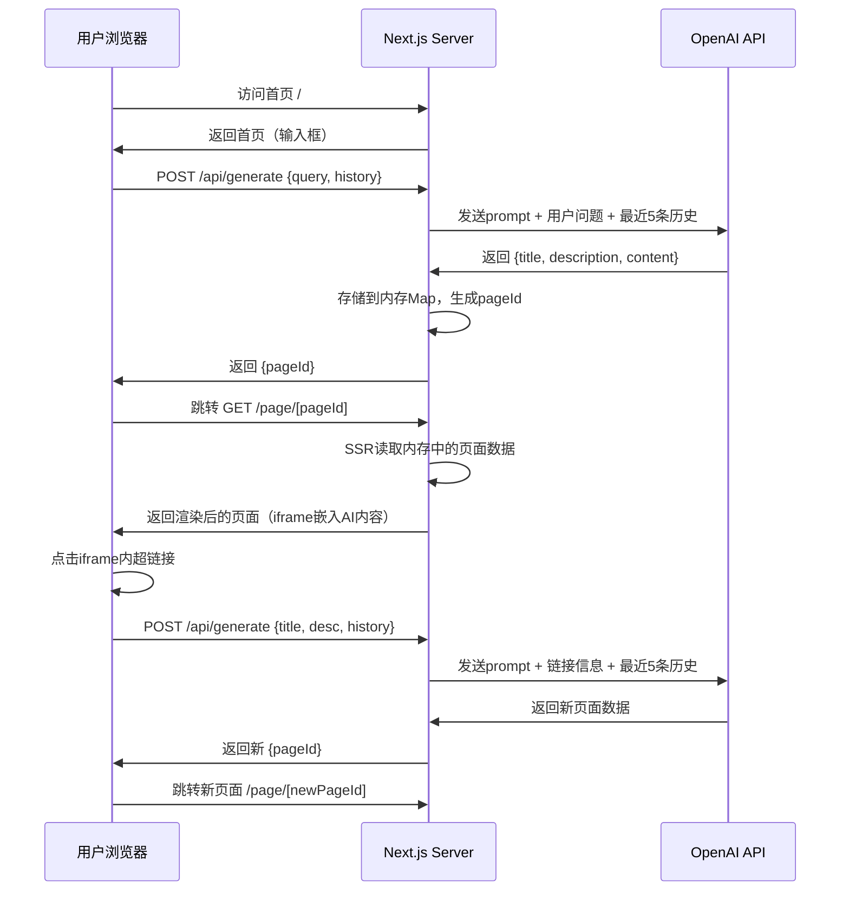

## 产品概述

一个AI驱动的无限页面生成网站（Infinity）。用户在首页输入问题后，AI以完整HTML页面的形式回复，用户可以在生成的页面中点击超链接，持续生成新的页面，形成无限探索的浏览体验。

## 核心功能

1. **首页对话入口**：用户访问网站后看到一个简洁的输入框，输入问题后提交
2. **AI页面生成**：AI接收用户问题，返回结构化数据（title、description、content），其中content为完整的HTML+TailwindCSS单页面内容
3. **生成页面渲染**：跳转到独立URL展示AI生成的HTML页面，页面包含标题、描述、以及完整渲染的HTML内容
4. **超链接导航生成**：生成的HTML页面中包含超链接，点击超链接后提取目标的title和description信息，带着这些信息再次调用AI生成新的页面并跳转
5. **上下文记忆**：每次生成新页面时，将最近5条已生成页面的title和description作为结构化上下文传递给AI，让AI了解用户的浏览轨迹
6. **页面加载状态**：生成页面时展示加载动画，提示用户AI正在生成内容

## 技术栈

- **框架**：Next.js 14+ (App Router, SSR)
- **语言**：TypeScript
- **样式**：TailwindCSS（项目自身样式） + TailwindCSS CDN（生成页面的样式渲染）
- **AI接口**：OpenAI 兼容接口（openai npm包，支持自定义 baseURL/model）
- **数据存储**：内存存储（Map），会话级别，无需数据库
- **包管理**：pnpm

## 实现方案

### 整体策略

采用 Next.js App Router 架构，首页为客户端交互页面，生成的AI页面通过动态路由 `/page/[id]` 以SSR方式渲染。AI生成的HTML内容通过 `sandbox iframe` 安全渲染，iframe内注入TailwindCSS CDN和超链接拦截脚本。

### 关键技术决策

1. **页面渲染方式选择 iframe 而非 dangerouslySetInnerHTML**：

- iframe提供天然的样式隔离，避免AI生成的HTML/CSS与主站样式冲突
- sandbox属性提供安全隔离，防止恶意脚本执行（仅允许 `allow-scripts allow-same-origin`）
- iframe内注入TailwindCSS CDN，确保AI生成的TailwindCSS类名正确渲染
- 通过 `postMessage` 实现iframe内超链接点击与父页面的通信

2. **超链接拦截机制**：

- AI生成的HTML中，超链接格式约定为 `<a href="#" data-title="目标标题" data-desc="目标描述">链接文字</a>`
- iframe内注入脚本拦截所有 `<a>` 标签点击事件，提取 `data-title` 和 `data-desc` 属性
- 通过 `window.parent.postMessage` 将 title/desc 传递给父页面
- 父页面接收消息后，调用API生成新页面并跳转

3. **内存存储设计**：

- 使用全局 `Map<string, PageData>` 存储生成的页面数据
- 使用全局 `Array<{title, description}>` 存储浏览历史（最多保留最近5条）
- 通过 session cookie 或 URL query 区分不同用户会话（简化方案：单用户场景使用全局存储）

4. **SSR生成流程**：

- 用户提交问题 → POST `/api/generate` → 服务端调用OpenAI → 存储页面数据到内存Map → 返回pageId
- 客户端收到pageId后 → 跳转 `/page/[id]` → SSR从内存读取页面数据 → 渲染完整页面

### AI Prompt 设计

给AI的系统提示要求其返回严格的JSON格式：

```
{
  "title": "页面标题",
  "description": "页面简短描述",
  "content": "<完整的HTML内容，使用TailwindCSS类名>"
}
```

#### Prompt 核心原则

**1. 语义驱动的页面风格**：页面视觉风格必须跟随内容语义。例如：

- 问"地球是什么样的" → 生成一个带有地球地图/可视化的科普页面，配色用蓝绿地球色调
- 问"天气" → 生成一个漂亮直观的天气仪表盘页面，用天气图标、温度曲线等可视化元素
- 问"东京旅游攻略" → 生成一个旅游风格的攻略页面，用卡片式景点推荐、路线规划等布局
- 问"写一首诗" → 生成一个优雅文学风格的排版页面
- Prompt中要求AI根据主题自主选择最合适的配色方案、布局方式和视觉元素

**2. 内容深度与表现力**：追求把问题讲清楚讲透彻，而不是敷衍几行文字。要求AI：

- 充分利用HTML+TailwindCSS的表现力：表格、卡片网格、列表、引用块、图标（使用emoji/unicode符号）、进度条、徽章等
- 页面内容要信息量充足、结构清晰、排版专业，像一个精心设计的专题网页而非简单文本
- 适当使用CSS实现的可视化效果（渐变色块、统计数字展示、时间线等）

**3. 真实性原则**：

- **非编造性任务**（事实查询、攻略、教程、数据展示等）：必须追求真实性和准确性，使用AI知识库中的真实数据和信息，不可胡编乱造。例如天气要给出合理的真实数据，旅游攻略要给靠谱的景点和建议
- **创作性任务**（写小说、编故事、创作诗歌等）：AI可以自由创作，发挥想象力
- Prompt中要明确区分这两类任务，并指导AI正确处理

提示中还要求：

- content中的超链接使用 `data-title` 和 `data-desc` 自定义属性
- 使用TailwindCSS进行样式设计，风格要匹配内容主题
- 上下文中包含最近5条浏览记录的结构化信息
- 鼓励AI在内容中嵌入丰富的相关超链接，引导用户深入探索相关话题

### 数据流



## 实现注意事项

1. **iframe高度自适应**：iframe内容加载后，通过 postMessage 通知父页面内容实际高度，父页面动态调整iframe高度，避免滚动条嵌套
2. **加载状态体验**：AI生成耗时较长（数秒），需要展示生成中的动画状态，采用流式提示让用户感知进度
3. **错误处理**：AI调用失败时展示友好的错误页面，提供重试按钮；页面不存在（id无效）时返回404
4. **环境变量配置**：通过 `.env.local` 配置 `OPENAI_BASE_URL`、`OPENAI_API_KEY`、`OPENAI_MODEL`，并提供 `.env.example` 模板
5. **内存清理**：虽然是会话级存储，仍需考虑内存上限，可设置最大页面数（如1000），超出后清理最早的页面
6. **安全考量**：iframe sandbox限制、CSP头设置，防止生成内容中的恶意行为

## 目录结构

```
infinity/
├── .env.example                    # [NEW] 环境变量模板，包含 OPENAI_BASE_URL、OPENAI_API_KEY、OPENAI_MODEL 配置示例
├── .env.local                      # [NEW] 本地环境变量（gitignore），存放实际的API密钥和配置
├── .gitignore                      # [NEW] Git忽略配置，排除 node_modules、.next、.env.local 等
├── next.config.ts                  # [NEW] Next.js配置文件，配置CSP安全头
├── tailwind.config.ts              # [NEW] TailwindCSS配置，定义主站使用的主题色和字体
├── postcss.config.mjs              # [NEW] PostCSS配置，集成TailwindCSS插件
├── tsconfig.json                   # [NEW] TypeScript配置，启用严格模式和路径别名
├── package.json                    # [NEW] 项目依赖配置，包含 next、react、openai、tailwindcss 等依赖
├── src/
│   ├── app/
│   │   ├── layout.tsx              # [NEW] 根布局组件。定义全局HTML结构、引入全局样式、设置meta信息和字体。提供暗色主题的基础样式。
│   │   ├── globals.css             # [NEW] 全局样式文件。引入TailwindCSS指令，定义暗色主题的CSS变量和基础样式。
│   │   ├── page.tsx                # [NEW] 首页组件。展示项目Logo/标题、居中的输入框、提交按钮。处理用户输入提交逻辑：调用/api/generate → 获取pageId → 跳转/page/[id]。包含加载状态展示。
│   │   ├── page/
│   │   │   └── [id]/
│   │   │       └── page.tsx        # [NEW] 生成页面的SSR渲染组件。从内存存储读取页面数据（title、description、content），渲染页面标题和描述，通过iframe安全嵌入AI生成的HTML内容。包含iframe高度自适应逻辑和超链接拦截通信（postMessage监听）。处理页面不存在的404情况。
│   │   └── api/
│   │       └── generate/
│   │           └── route.ts        # [NEW] 页面生成API路由（POST）。接收用户输入（query或title+desc）和浏览历史。构建AI prompt（含最近5条历史）。调用OpenAI兼容接口获取生成结果。解析AI返回的JSON，存储页面数据到内存，更新浏览历史。返回pageId。包含完善的错误处理。
│   ├── lib/
│   │   ├── store.ts                # [NEW] 内存存储模块。导出全局 pageStore（Map<string, PageData>）和 historyStore（浏览历史数组）。提供 addPage、getPage、getRecentHistory、清理过期页面等工具函数。设置最大存储页面数上限。
│   │   ├── openai.ts               # [NEW] OpenAI客户端封装。读取环境变量初始化OpenAI客户端（支持自定义baseURL和model）。封装 generatePage 函数，接收用户输入和历史上下文，构建system prompt和user prompt，调用API并解析返回的JSON结果。
│   │   └── prompt.ts               # [NEW] AI Prompt模板。定义system prompt（要求AI返回JSON格式的title/description/content，content使用TailwindCSS，超链接使用data-title/data-desc属性）。定义构建user prompt的函数（组合用户问题+历史上下文）。
│   ├── components/
│   │   ├── SearchInput.tsx          # [NEW] 首页搜索输入组件。包含输入框、提交按钮、加载状态动画。支持回车提交和按钮提交。展示placeholder提示文字。
│   │   ├── PageRenderer.tsx         # [NEW] AI生成页面渲染组件。通过srcdoc方式创建iframe，注入TailwindCSS CDN link、AI生成的HTML content、以及超链接拦截脚本。监听iframe的postMessage事件（高度变化、链接点击）。处理iframe高度自适应。
│   │   ├── LoadingScreen.tsx        # [NEW] 页面生成中的加载屏幕组件。展示加载动画（脉冲/旋转效果）和提示文字"AI正在生成页面..."。用于首页提交后和超链接跳转时的等待状态。
│   │   └── PageHeader.tsx           # [NEW] 生成页面的头部组件。展示页面title和description，提供"返回首页"按钮。展示简洁的导航信息。
│   └── types/
│       └── index.ts                # [NEW] TypeScript类型定义。定义 PageData（id, title, description, content, createdAt）、HistoryItem（title, description）、GenerateRequest（query?, title?, description?, history?）、GenerateResponse（pageId）等核心类型。
```

## 核心类型定义

```typescript
// src/types/index.ts
interface PageData {
  id: string;
  title: string;
  description: string;
  content: string;  // AI生成的HTML+TailwindCSS内容
  createdAt: number;
}

interface HistoryItem {
  title: string;
  description: string;
}

interface GenerateRequest {
  query?: string;         // 首页用户输入的问题
  title?: string;         // 超链接跳转时的目标标题
  description?: string;   // 超链接跳转时的目标描述
  history: HistoryItem[]; // 最近5条浏览历史
}

interface GenerateResponse {
  pageId: string;
}
```

## 设计风格

采用暗色科技风（Dark Futuristic）设计，营造无限探索的沉浸感。背景为深色渐变，搭配微妙的星空/粒子动效，主色调为靛蓝到紫色的渐变。整体氛围神秘、高级、富有科技感。

## 页面设计

### 页面1：首页（对话入口）

- **顶部区域**：极简导航栏，左侧显示"Infinity"品牌Logo（使用无限符号 + 文字），右侧留空保持简洁
- **主内容区**：垂直居中布局。顶部展示大标题"Explore the Infinite"和副标题"Ask anything, discover everything"，使用渐变文字效果。下方为大尺寸搜索输入框，圆角设计，带有微妙的发光边框动效（focus时更亮）。输入框右侧嵌入发送按钮（箭头图标）。
- **底部提示区**：底部展示3-4个示例问题标签（如"What is quantum computing?"），点击可直接填入输入框，帮助用户快速开始
- **背景效果**：深色渐变背景（从深蓝到近黑），带有缓慢飘动的微光粒子效果（CSS animation实现）

### 页面2：加载过渡页

- **整页加载**：深色背景上居中展示一个脉冲动画的无限符号，下方显示"Generating your page..."文字，文字带有呼吸灯效果
- **进度感知**：下方可显示随机的趣味提示文字，每2秒切换一条

### 页面3：AI生成页面展示

- **顶部导航栏**：固定在顶部，左侧显示"Infinity"品牌Logo（点击返回首页），中间显示当前页面title（单行截断），右侧显示一个"New Search"按钮返回首页
- **页面信息区**：导航栏下方展示页面description，使用较小字号和浅灰色文字，1-2行展示
- **内容渲染区**：占据剩余全部空间，iframe全宽渲染AI生成的HTML内容，无边框，背景为白色（AI内容区域），与外部暗色主题形成对比，让内容区域清晰突出
- **iframe内超链接**：悬停时展示发光效果，点击触发新页面生成